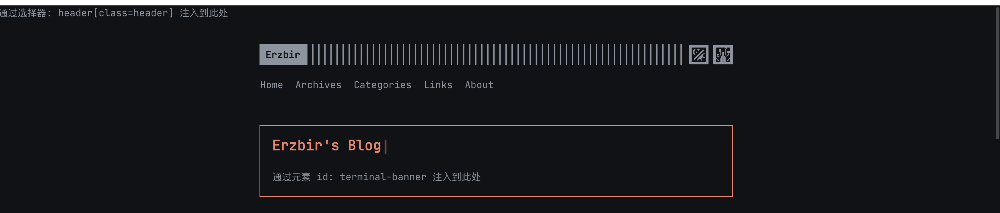
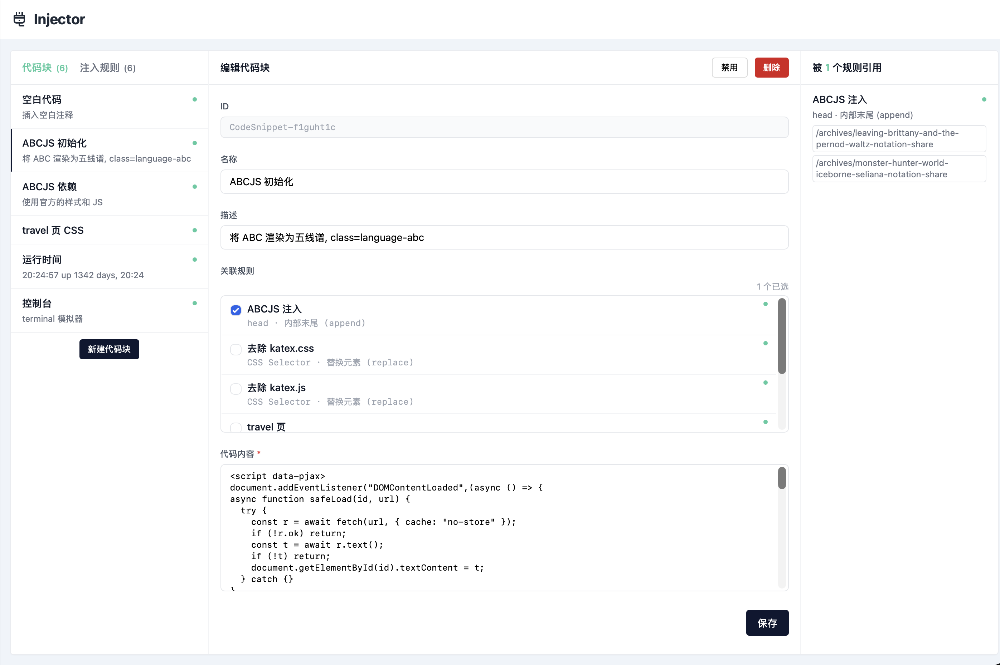
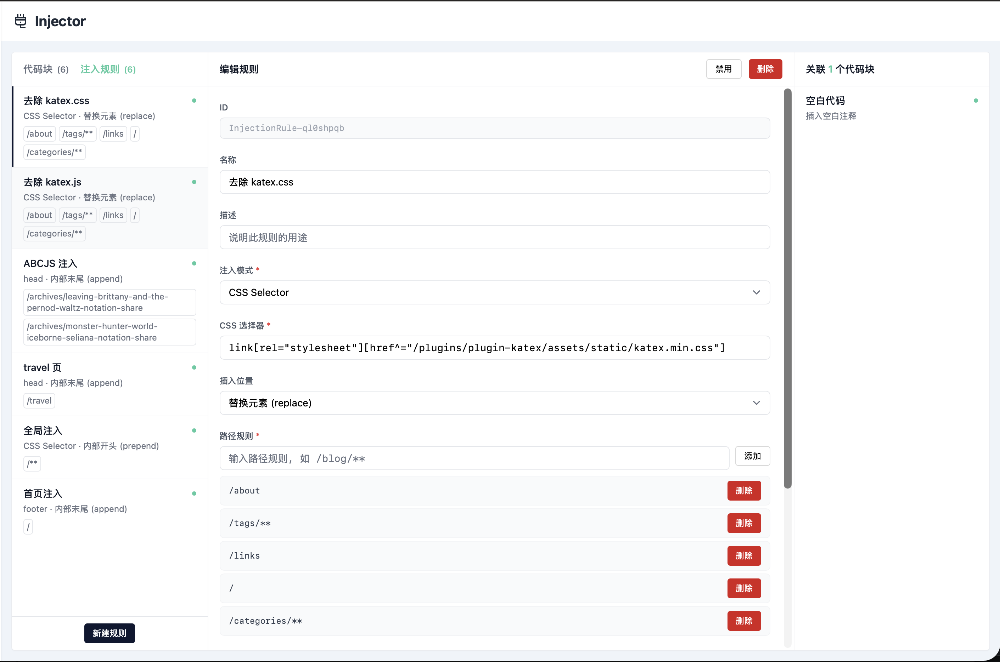

## 这是什么?

一个用于 **将 HTML 代码注入到指定页面** 的 Halo 插件

Halo 自带的代码注入功能仅支持全局注入, 此插件允许将特定的代码注入指定页面

---

## 功能特性

* 按页面路径注入 HTML 代码
* 支持注入:
    * `<head>` 标签中
    * `<footer>` 标签中
    * 指定 `id` 的元素
    * 匹配 `CSS selector` 的元素



## 示例配置

配置页面在: 管理后台 -> 工具 -> Injector




## 注入机制说明

插件提供四种注入模式:

| 模式         | 实现方式                      | 说明                             |
|------------|---------------------------|--------------------------------|
| `head`     | `TemplateHeadProcessor`   | 插入到 `<head>` 标签中               |
| `footer`   | `TemplateFooterProcessor` | 插入到 `<halo:footer/>` 中(主题控制位置) |
| `id`       | `AdditionalWebFilter`     | 通过元素 ID 定位插入                   |
| `selector` | `AdditionalWebFilter`     | 通过 CSS 选择器匹配插入, 会处理所有匹配到的元素    |

> `id` 与 `selector` 模式为临时实现方案,
> 因其需在服务端完整读取 HTML, 因此使用了 `AdditionalWebFilter`, 这会导致性能下降, 非特殊情况尽量不要使用
>
> 需要根据 ID 的注入时, 可以在 `<head>` 中注入 JS 代码, 并通过此 JS 来匹配 ID

## 注入位置选项

在 `id` 或 `selector` 模式下, 可通过配置选择注入方式:

* `append`: 追加为目标元素的子元素
* `prepend`: 插入到目标元素第一个子元素之前
* `before`: 插入到目标元素之前
* `after`: 插入到目标元素之后
* `replace`: 替换目标元素

> 注入到 `<head>` 时需注意 HTML 合法性. 例如 `<div>` 等块级标签不会被放入 `<head>`, 而是自动插入到 `<body>` 的第一个子元素位置

## 开发环境

- Java 21+
- Node.js 18+
- pnpm

## 开发

```bash
# 构建插件
./gradlew build

# 开发前端
cd ui
pnpm install
pnpm dev
```

构建完成后, 可以在 `build/libs` 目录找到插件 jar 文件

## 许可证

[GPL-3.0](./LICENSE) © Erzbir 